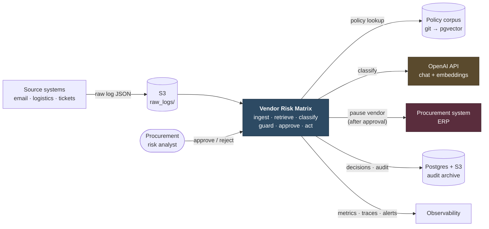
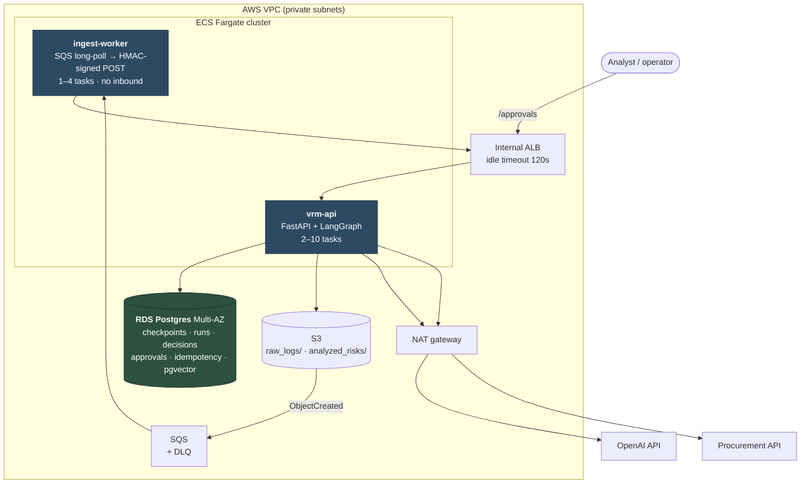
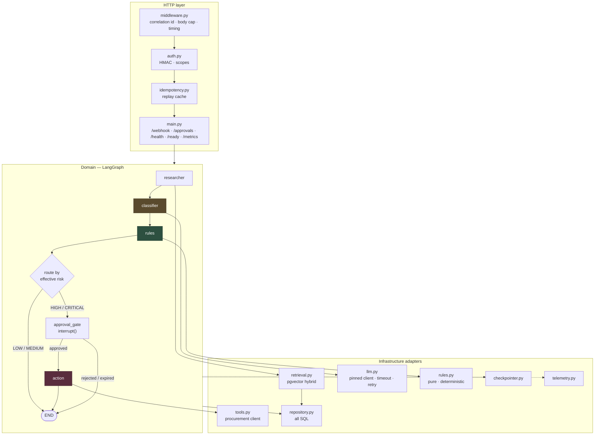
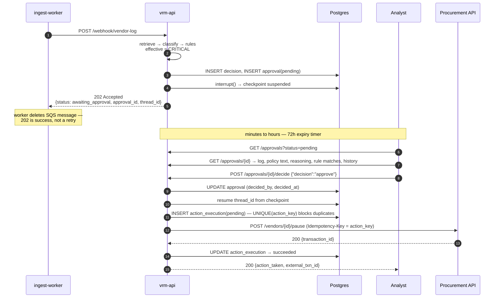
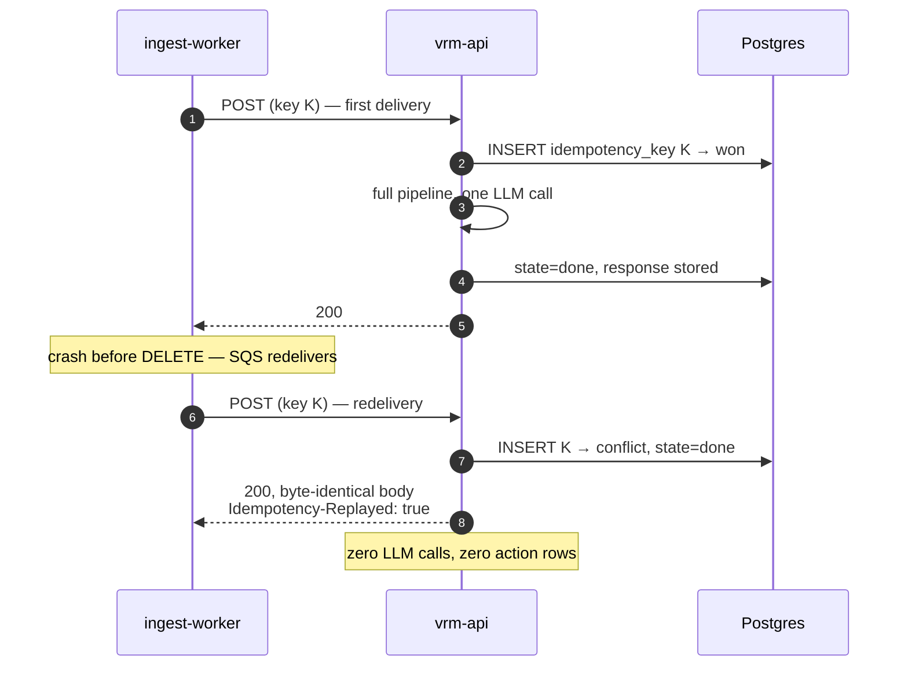

# High-Level Design — Autonomous Vendor Negotiation & Risk Matrix

- **Status:** Phase 1 target architecture. Describes where the system is going, not where it is.
- **Date:** 2026-08-22
- **Baseline:** commit `fdfbc5e`, the only commit on `main`
- **Companion documents:** [LLD.md](LLD.md) · [ADRs](decisions/README.md) · [SLOS.md](SLOS.md) · [THREAT_MODEL.md](THREAT_MODEL.md) · [RISK_TAXONOMY.md](RISK_TAXONOMY.md) · [ROADMAP.md](ROADMAP.md)

Statements about the **current** system cite `file:line`. Statements about the **target** system
cite the ADR that decided them. Anything with neither is a claim, and claims do not belong in a
design document.

---

## 1. Problem and scope

### 1.1 What this system is for

Procurement teams receive a continuous trickle of unstructured bad news about suppliers — a late
shipment, an unannounced price rise, a failed inspection — as email, ticket notes, and logistics
logs. Someone must read each one, recall which contract clause it breaches, and judge whether it
is noise or the start of a serious problem. That work is slow, inconsistent between readers, and
in practice only happens for the loudest complaints. The quiet pattern — a supplier four days late
*every single month* — is exactly what a human reader misses.

This system reads that text, retrieves the internal policies it touches, assigns a risk level with
cited reasoning, and — subject to human approval — suspends the vendor's purchasing authority.

### 1.2 In scope

- Ingest one vendor message at a time from an object store via a queue.
- Retrieve applicable policy passages from a versioned corpus.
- Classify risk as `LOW` / `MEDIUM` / `HIGH` / `CRITICAL` with cited policy ids and reasoning.
- Enforce deterministic, countable policy rules independently of the model.
- Route `HIGH`/`CRITICAL` to a human approval queue before any irreversible action.
- Execute exactly one vendor pause per `(vendor, log, action)` on approval.
- Persist a complete, replayable audit record of every decision.
- Measure quality continuously and block regressions in CI.

### 1.3 Explicitly out of scope

| Not building | Why |
|---|---|
| Negotiation with vendors | The name says "negotiation"; the system assesses and escalates. Nothing here drafts or sends vendor communications. |
| A general procurement UI | Approval is API-only ([ADR-0005](decisions/0005-autonomy-level.md)). |
| Fine-tuning or training a model | No model is fitted. ROADMAP Phase 3's name is inherited from a template; the work is prompt engineering, retrieval tuning, and reliability. |
| Multi-tenancy | Single organisation, single policy corpus. |
| Real-time streaming | Per-message, queue-buffered. Target throughput ([SLOS §3](SLOS.md)) is well inside what one queue and a few tasks handle. |
| Automatic un-pausing | Reversal is a deliberate, elevated-privilege human action ([ADR-0008](decisions/0008-api-authentication.md)). |

### 1.4 Actors

| Actor | Interaction |
|---|---|
| **Source systems** (email gateway, logistics platform, ticketing) | Write raw logs to S3. No knowledge of this system. |
| **Procurement risk analyst** | Approves or rejects `HIGH`/`CRITICAL` cases. The only human in the request path. |
| **Supply-chain ops** | Consumes decisions downstream. Does not operate the system. |
| **Platform operator** | Deploys, monitors, reverses actions, rotates credentials. |
| **Vendor** | The **subject** of assessment, never a user. Their text is untrusted input ([THREAT_MODEL §4](THREAT_MODEL.md)). |

---

## 2. Architecture at three levels

### 2.1 Level 1 — System context



Two external systems carry the interesting risk. **OpenAI** is a single point of failure for
classification, deliberately accepted because the queue buffers an outage
([ADR-0001](decisions/0001-llm-provider.md)). **The procurement system** is where irreversible
side effects land, which is why everything upstream of it is designed around exactly-once
delivery and human approval.

### 2.2 Level 2 — Containers



| Container | Responsibility | Scales on | Fails how |
|---|---|---|---|
| `ingest-worker` | Long-poll SQS, fetch S3 object, sign, POST, delete on success | SQS queue depth | Message returns to queue; DLQ after 5 receives |
| `vrm-api` | Auth, validation, idempotency, graph execution, persistence, approvals | Requests per target | Task drains to checkpoint on SIGTERM; ALB removes it on `/ready` 503 |
| RDS Postgres | Checkpoints, audit record, approvals, idempotency, policy vectors | Vertical + read replica later | Multi-AZ failover ~60–120 s; API returns 503 meanwhile |
| S3 | Raw log durability, result archive | — | Archive write failure alerts, never silent ([ADR-0010](decisions/0010-data-retention.md)) |
| SQS + DLQ | Buffer and redelivery | — | DLQ depth > 0 alerts |

**Both Fargate services run the same image** with different entrypoints
([ADR-0007](decisions/0007-deployment-target.md) §1) — the worker can never be a different code
version than the API it calls.

### 2.3 Level 3 — Components inside `vrm-api`



Two structural rules make the rest of the design work:

1. **The classifier has no tools.** It returns a structured verdict and nothing else. The action is
   reached by a **graph edge**, never by a model tool call. A prompt injection can influence the
   verdict; it cannot invoke a side effect. This is the single most important control in the
   system ([THREAT_MODEL §4](THREAT_MODEL.md)).
2. **`rules` runs after `classifier`.** The deterministic floor is applied *over* the model's
   output, so the model can raise a level and never lower one
   ([ADR-0009](decisions/0009-deterministic-guardrails.md)).

### 2.4 Current vs target topology

```
CURRENT (fdfbc5e)                       TARGET
─────────────────                       ──────
unauthenticated POST                    S3 → SQS → worker → HMAC POST → idempotency
        │                                       │
   researcher  (dict lookup,             researcher  (pgvector hybrid, deterministic order,
                random order)                         policy ids persisted)
        │                                       │
   classifier  (LLM client built         classifier  (singleton client, timeout, bounded retry,
                per request, no                       strict JSON schema, tokens+cost recorded)
                timeout/retry)                  │
        │                                  rules      (deterministic floor, vendor history)
   route_by_risk                                │
        │                               route_by_effective_risk
   action      (mock string,                    │
                immediate,              approval_gate → interrupt() → human
                irreversible)                   │
        │                                  action     (real API, exactly-once, reversible)
       END                                      │
                                            persist + archive → END
   nothing persisted                    every element replayable for 7 years
```

---

## 3. Request lifecycles

### 3.1 Happy path — LOW/MEDIUM, no action

```mermaid
sequenceDiagram
    autonumber
    participant W as ingest-worker
    participant A as vrm-api
    participant P as Postgres
    participant O as OpenAI

    W->>A: POST /webhook/vendor-log<br/>HMAC + Idempotency-Key
    A->>A: verify signature, cap body, mint correlation_id
    A->>P: INSERT idempotency_key (ON CONFLICT DO NOTHING)
    A->>P: UPSERT vendor_log, INSERT run (thread_id = sha256(vendor‖text))
    A->>O: embed(log_text)
    A->>P: hybrid vector search → top-5 chunks
    A->>P: checkpoint(researcher)
    A->>O: classify (strict JSON schema, timeout 35s)
    A->>P: INSERT llm_call (tokens, cost, latency)
    A->>P: checkpoint(classifier)
    A->>P: SELECT vendor_history (one query)
    A->>A: rule_floor = f(log, history) → LOW
    A->>P: BEGIN; INSERT decision + retrieval rows; COMMIT
    A-->>W: 200 + WorkflowResult
    A--)P: archive to S3 (post-commit, alert on failure)
```

### 3.2 HIGH/CRITICAL — the approval interrupt



The `202` is load-bearing. A pending approval is a **successful** outcome, not a failure — if the
worker treated it as retryable it would resubmit the same log every visibility timeout for 72
hours ([ADR-0004](decisions/0004-ingestion-topology.md) §3).

### 3.3 Duplicate delivery



If the key were *different* but the content identical, Layer 1 misses and **Layer 2** catches it:
`UNIQUE(action_key) WHERE status IN ('pending','succeeded')` rejects the second insert, and the
action node returns the existing `external_txn_id` without any network call
([ADR-0006](decisions/0006-idempotency.md)).

---

## 4. Cross-cutting design

### 4.1 Failure model

| Failure | Detection | Behaviour | Data loss |
|---|---|---|---|
| OpenAI 429/5xx | HTTP status | Retry ×3, exp backoff + jitter | none |
| OpenAI down past budget | `LLMUnavailable` | `503` + `Retry-After`; SQS redelivers; run resumes from checkpoint | none |
| OpenAI returns invalid schema | `LLMSchemaViolation` | **No retry.** Persist raw output, `502`, alert | none |
| Postgres failover | Connection error | `503`; ALB drains via `/ready`; SQS redelivers | none |
| API task killed mid-run | — | Resume from last checkpoint on same `thread_id` | none |
| Procurement API 5xx | HTTP status | Retry ×3 (safe — carries `action_key`); then `action_execution=failed`, alert | none |
| Procurement API times out, unknown outcome | Timeout | Row stays `pending`. Reaper **queries the procurement API** before resolving — it must never guess | none |
| Duplicate delivery | Unique constraint | Replay or no-op | none |
| Poison message | 4xx from API | Worker deletes, DLQ alarm | logged |
| Approval never given | 72h timer | `EXPIRED`, **no action**, alert | none |
| S3 archive write fails | Exception | Alert + metric. **Never swallowed** | archive only; DB is authoritative |

The invariant across every row: **a failure may delay a decision, and may leave a message on the
queue, but must never produce an unrecorded action or a lost log.**

### 4.2 Where state lives

| State | Store | Lifetime | Authoritative? |
|---|---|---|---|
| Raw log | S3 `raw_logs/` | 2y hot → 7y Glacier | yes (input) |
| Graph checkpoints | Postgres | 30 days | no (rebuildable) |
| Decisions, approvals, actions | Postgres | 7 years | **yes** |
| Policy corpus | git `data/policies/` | forever | **yes** |
| Policy vectors | Postgres pgvector | until reindex | no (derived) |
| Idempotency keys | Postgres | 7 days | no |
| Result archive | S3 `analyzed_risks/` | 7 years | no (mirror) |

Everything derived is rebuildable from something authoritative. The vector index can be dropped
and rebuilt from git; checkpoints can be discarded and runs re-driven from S3.

### 4.3 Trust boundaries

```
┌─ untrusted ────────────────────────────────────────────────┐
│  vendor log text — attacker-controlled, may contain         │
│  prompt injection, oversized payloads, hostile unicode      │
└──────────────────┬──────────────────────────────────────────┘
                   │ body cap, schema validation, delimiter fencing
┌─ semi-trusted ───▼──────────────────────────────────────────┐
│  ingest-worker — our code, our credentials, but its input    │
│  is untrusted, so its output is treated as untrusted too     │
└──────────────────┬──────────────────────────────────────────┘
                   │ HMAC signature + timestamp + body hash
┌─ trusted ────────▼──────────────────────────────────────────┐
│  vrm-api domain — rules, persistence, routing                │
└──────────────────┬──────────────────────────────────────────┘
                   │ human approval + unique action_key
┌─ irreversible ───▼──────────────────────────────────────────┐
│  procurement system — real commercial consequence            │
└─────────────────────────────────────────────────────────────┘
```

Each boundary narrows what can pass. Full analysis in [THREAT_MODEL.md](THREAT_MODEL.md).

### 4.4 Quality architecture

Quality is a build-time gate, not an aspiration:

```
data/golden/labeled_logs.jsonl  ──►  evals/run_eval.py  ──►  macro-F1, confusion matrix,
  (≥200 rows, ≥50 real,                     │                false-pause rate, per-rule FP rate
   source-tagged)                           │
                                            ├─► exit non-zero if macro-F1 < 0.80
evals/cases/ (adversarial)      ──────────► ├─► exit non-zero if false-pause > 2%
  prompt injection, empty,                  └─► exit non-zero if any injection case pauses
  50k chars, non-English                                │
                                                        ▼
baselines/keyword_classifier.py ──► must be beaten   .github/workflows/eval.yml (per PR)
                                     by ≥15 F1 pts   .github/workflows/nightly-eval.yml (drift)
```

The false-pause rate is the headline metric, not accuracy — because a wrongly paused vendor costs
orders of magnitude more than a missed escalation ([ADR-0005](decisions/0005-autonomy-level.md),
[SLOS §4](SLOS.md)). It is also the number that gates autonomy.

### 4.5 Observability

| Signal | Mechanism | Key series |
|---|---|---|
| Metrics | Prometheus at `/metrics` | `vendor_risk_classifications_total{risk_level}`, `llm_tokens_total{kind}`, `llm_cost_usd_total`, `vendor_pauses_total`, `approval_pending_gauge`, `archive_failures_total` |
| Traces | OpenTelemetry, one trace per request | Spans `researcher`, `classifier`, `rules`, `action`; classifier span carries `model_id`, `prompt_version`, token counts |
| Logs | Structured JSON | Always `correlation_id`, `thread_id`, `vendor_id`, `log_hash`. **Never** raw log text |
| Health | `/health` (liveness) vs `/ready` (dependencies) | `/ready` returns 503 when Postgres or OpenAI is unreachable; `/health` stays 200 |

`X-Correlation-Id` is returned on every response, including errors. Today the correlation id is
minted (`app/main.py:194`) and logged but **never surfaced to the caller** — so a caller cannot
reference a successful run. Fixed in the target design.

---

## 5. Non-functional requirements → design response

| NFR | Target ([SLOS.md](SLOS.md)) | Design response |
|---|---|---|
| Latency | p95 ≤ 12 s (excl. approval) | Singleton LLM client; retrieval `k=8`→5; HNSW index; timeout ladder ([ADR-0007](decisions/0007-deployment-target.md) §4) |
| Availability | 99.5% monthly | 2+ tasks, Multi-AZ RDS, queue buffering, `/ready`-driven draining |
| Durability | zero log loss | S3 authoritative + at-least-once SQS + durable checkpoints |
| Correctness | macro-F1 ≥ 0.80 | Golden set + eval gate in CI + adversarial suite |
| Safety | false-pause ≤ 2% | Human approval + deterministic floor + exactly-once action |
| Cost | ≤ $2.00 / 1000 logs | Small-tier model; capped prompt size; token+cost metrics; idempotency prevents double spend |
| Security | no unauthenticated side effects | HMAC ingest, scoped operator credentials, private ALB, 256 KB cap |
| Auditability | 7-year replayable record | Decision committed before action; prompt version + hash stored |
| Reproducibility | identical builds | `uv.lock`, immutable image tags, pinned model ids |

---

## 6. Capacity and cost

**Design point:** 5,000 logs/day (~0.06/s mean, ~1/s peak-hour burst).

| Resource | Sizing | Headroom |
|---|---|---|
| `vrm-api` | 2 tasks × 1 vCPU / 2 GB | ~20 concurrent runs; ≫ peak |
| `ingest-worker` | 1 task, 4 concurrent | 4 × (1/12 s) ≈ 20k logs/day |
| RDS | db.t4g.medium Multi-AZ | ~50 conn; pool 10/task |
| pgvector | ≤ 5k chunks × 1536 dims ≈ 30 MB | HNSW fits in RAM |
| SQS | — | effectively unbounded buffer |

**Cost model per log** — the formula matters more than the numbers, because the token counts are
the estimates and the rate is the variable to plug in:

```
tokens_in  ≈ 1200   (system prompt ~250 + log ~350 + 5 policy chunks ~600)
tokens_out ≈  400   (structured verdict with reasoning)
embedding  ≈  350   (log text, once per run)

cost_per_log = 1200·rate_in + 400·rate_out + 350·rate_embed
```

The **ceiling is $2.00 per 1000 logs** ([SLOS §6](SLOS.md)) — roughly 4× a small-tier model's
expected cost, so the alarm fires on a genuine regression (prompt bloat, retry storm, model
change) rather than on normal variance. `llm_cost_usd_total` makes actual spend computable from
`/metrics` alone.

Infrastructure is **fixed cost, not per-log**: Fargate tasks + Multi-AZ RDS + NAT gateway
dominate at this volume, and the NAT gateway is typically the largest single line
([ADR-0007](decisions/0007-deployment-target.md)).

---

## 7. Build order and risk

Phase mapping to [ROADMAP.md](ROADMAP.md) §4; ADR references show what each phase implements.

| Phase | Delivers | Gated by |
|---|---|---|
| **1 — Planning** *(this document)* | HLD, LLD, 10 ADRs, taxonomy, SLOs, threat model, corrected README | κ ≥ 0.6 inter-rater check |
| **2 — Data** | Policy corpus, golden set, pgvector index, committed ingest scripts | recall@5 ≥ 0.90; cross-process ordering stable |
| **3 — Reliability** | `llm.py`, `rules.py`, checkpointer, interrupt, versioned prompts, unit tests | Kill test; guardrails unbypassable; ≥ 25 tests |
| **4 — Evaluation** | Eval harness, adversarial cases, integration tests, CI gate | macro-F1 ≥ 0.80; false-pause ≤ 2%; 0 injection pauses |
| **5 — Deployment** | Dockerfile, lockfile, auth, idempotency, real procurement client, Terraform | Unauthenticated POST → 401; double-delivery → one pause |
| **6 — Operations** | Telemetry, `/metrics`, `/ready`, dashboards, alerts, drift check, runbook | Fault-injection alert < 5 min; nightly drift issue |

### Top risks

| Risk | Impact | Mitigation | Owner phase |
|---|---|---|---|
| **No reversal endpoint exists** | Autonomy permanently impossible; a wrongful pause is unfixable by the system | Confirm before Phase 5 — ROADMAP Open Decision 8, [ADR-0008](decisions/0008-api-authentication.md) | **now** |
| **No SME to label 50 real logs** | Phase 4 thresholds become indicative, not measured | Approval queue generates real labels as a by-product ([ADR-0005](decisions/0005-autonomy-level.md)) | 2 |
| **Synthetic data flatters scores** | System looks better than it is | `source` tag on every row; report metrics split by source, never pooled | 2, 4 |
| **Prompt injection** | Suppressed escalation | Model has no tools; deterministic floor; adversarial CI gate | 3, 4 |
| **Policy corpus never materialises** | Retrieval stays fake | Corpus is the hard dependency of Phases 2–6. If stakeholders cannot supply it, say so now | 2 |
| **Uncommitted parent work lost** | Days of ingestion work gone | Commit verbatim to a branch **before** any refactor | **now** |
| **Cost runs away** | Unbounded spend | Body cap, token metrics, cost alarm at 80% of ceiling | 5, 6 |
| **Unattended approval queue** | An expensive way to do nothing | 72h expiry alert; `approval_pending_gauge` alarm | 6 |

---

## 8. Rejected architectures

| Alternative | Rejected because |
|---|---|
| **True multi-agent** (independent researcher/classifier/action agents with tool-calling) | The name says "multi-agent"; the workload does not need it. Two of the three current nodes contain no model call (`app/agents.py:40-66`, `:165-228`). Giving the classifier tools would hand a prompt injection a route to the pause action — the exact thing §2.3 rule 1 forbids. A 3-step pipeline with one branch is the honest shape, and it is cheaper, faster, and testable. |
| **Synchronous end-to-end with no queue** | An LLM outage becomes lost logs. The queue is what makes single-provider ([ADR-0001](decisions/0001-llm-provider.md)) acceptable. |
| **Event-sourced core** | A good fit for an audit-heavy domain and worth revisiting. Materially more machinery than a 3-node graph justifies today ([ADR-0010](decisions/0010-data-retention.md)). |
| **Confidence-threshold autonomy** | `confidence_score` (`app/models.py:33-37`) is a model self-report, not a calibrated probability — and it is the first thing an injection manipulates. |
| **Per-vendor fine-tuned models** | No training data, no eval baseline, and a per-vendor quality surface nobody can monitor. |
